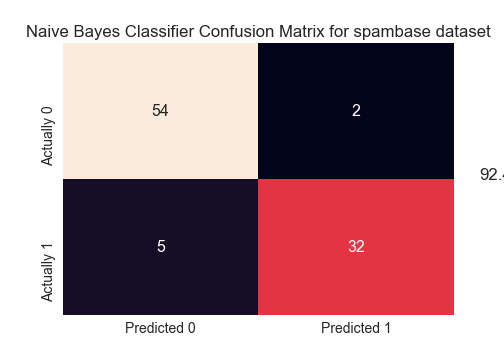
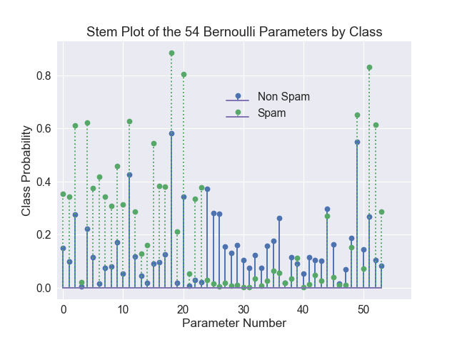
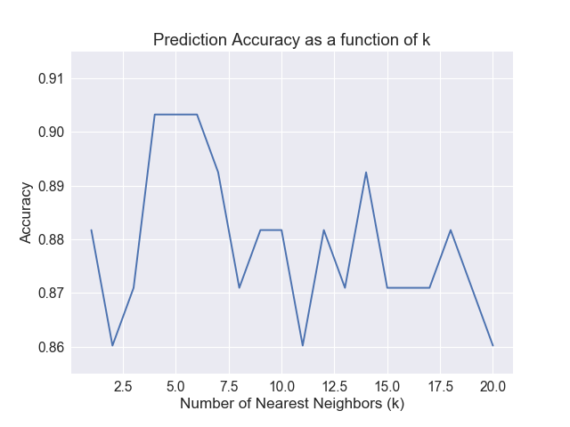
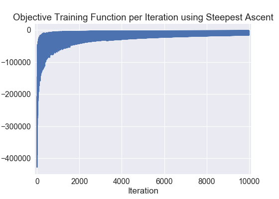
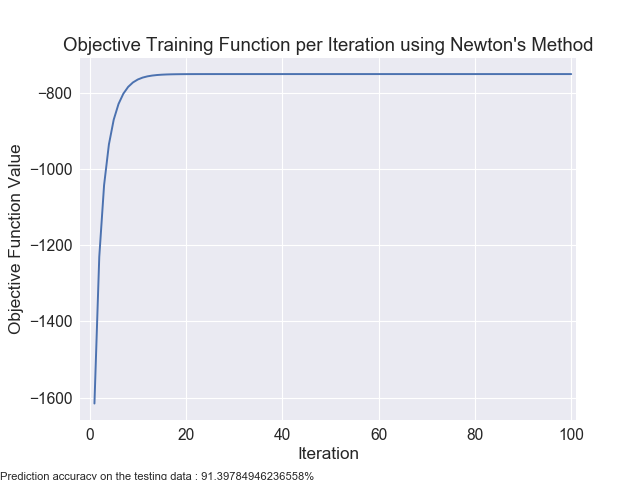

# Classification_Implementations

The goal of this project was to implement the Naive Bayes classifier, k-NN algorithm, and Logistic Regression from scratch. We will test the models on the spambase dataset, predicting spam vs not spam.

## Data
The data consists of examples of spam and non-spam emails, of which there are 4508 training examples and 93 testing examples. The feature vector x is a 57-dimensional vector extracted from the email and y = 1 indicates a spam email. The data has been preprocessed such that the first 54-dimensions of each observation is binary and the last three dimensions are positive numbers. Ideally, we would use cross-validation on multiple partitions, but I am keeping it simple here with one training and one testing as the main goal is to implement the classifiers.

## Technology Used
- Python 3

## Results

### Naive Bayes
The model was about 92.47% accurate

The 16th dimension is the word frequency of the word ”free”, while the 52nd dimension is the character frequency of the character ‘!’. We can see that both the probability of the word free and the character ‘!’ belonging to a spam email is significantly higher than in a non-spam email. Since the value for these two parameters are high in spam and relatively low in non-spam, these two parameters will more greatly influence the classification of an email. Intuitively, ”free” is a word that can easily be used to solicit peoples attention, offer opportunities or items at no charge, which we know is generally not real and hence spam. An exclamation point is used to induce urgency and excitement, which can especially be seen when offers of some sort are made. They are not generally commonplace in a conversation or email thread since the exclamation is not commonplace itself in general conversations. Therefore the results from the stem plot also intuitively make sense.

### Nearest Neighbors

I noticed that the accuracy slightly changes depending on how you both deal with tie breakers and the order of which you sort the points with the same distance. For this implementation, I broke ties randomly and used the sorting method in python pandas. k values of 4, 5, and 6 gave me the highest accuracy of about 90.32%.

### Logistic Regression

The prediction accuracy is about 91.40%.

